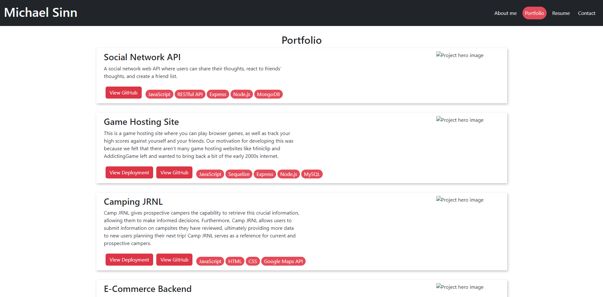

# Personal Portfolio

## Description

Personal Portfolio for Michael Sinn. Michael Sinn is a full stack web developer who has been programming for over a decade. The portfolio page is made to display experience with popular programming languages and frameworks such as Javascript, HTML, CSS, P5, NoSQL, Python, Flask, React, and Node.js. This page is meant as a hub with which Michael's main projects will be showcased and linked to. Contact information for Michael can be found at the bottom of the page.

## Installation

No installation required, the webpage is hosted at https://michaelsinn.github.io/submission-portfolio/

## Usage

To use the site, navigate to https://michaelsinn.github.io/submission-portfolio/

## Credits

Michael Sinn - https://github.com/MichaelSinn

## License

MIT License

Copyright (c) 2022 Michael Sinn

Permission is hereby granted, free of charge, to any person obtaining a copy
of this software and associated documentation files (the "Software"), to deal
in the Software without restriction, including without limitation the rights
to use, copy, modify, merge, publish, distribute, sublicense, and/or sell
copies of the Software, and to permit persons to whom the Software is
furnished to do so, subject to the following conditions:

The above copyright notice and this permission notice shall be included in all
copies or substantial portions of the Software.

THE SOFTWARE IS PROVIDED "AS IS", WITHOUT WARRANTY OF ANY KIND, EXPRESS OR
IMPLIED, INCLUDING BUT NOT LIMITED TO THE WARRANTIES OF MERCHANTABILITY,
FITNESS FOR A PARTICULAR PURPOSE AND NONINFRINGEMENT. IN NO EVENT SHALL THE
AUTHORS OR COPYRIGHT HOLDERS BE LIABLE FOR ANY CLAIM, DAMAGES OR OTHER
LIABILITY, WHETHER IN AN ACTION OF CONTRACT, TORT OR OTHERWISE, ARISING FROM,
OUT OF OR IN CONNECTION WITH THE SOFTWARE OR THE USE OR OTHER DEALINGS IN THE
SOFTWARE.
